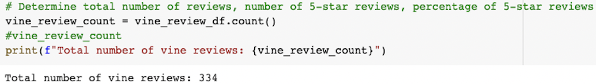
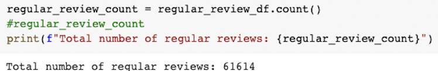
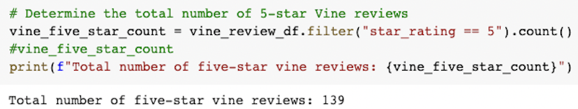
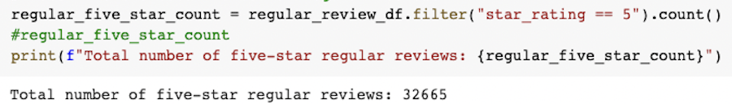
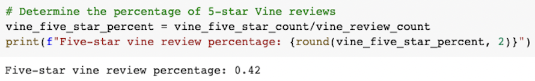
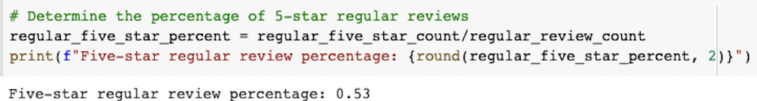

# Vine Or Vine Not

## Overview
SellBy needs assistance in determining the efficacy of a paid Amazon Vine program for their products. SellBy stakeholders would like to know if there is a bias toward favorable reviews in the Vine program. I will analyze a dataset of sports merchandise to calculate the total number of reviews, the number of 5-star reivews, and the percentage of 5-star reviews for both Vine and non-Vine members.

---
## Results
* **How many Vine reviews were there?**

    There were a total of 334 Vine reviews: 

    

* **How many non-Vine reviews were there?**

    Appropriately, the amount of regular reviews was much higher with a total of 61,614 reviews:

    

* **How many Vine reviews were 5 stars?**

    For the Vine review program, there was a total of 139 five-star reviews:

    

* **How many non-Vine reviews were 5 stars?**

    For the non-Vine reviews, a total of 32,665 reviews were five stars:

    

* **What percentage of Vine reviews were 5 stars?**

    The percentage of Vine five-star reviews was 42%:

    

* **What percentage of non-Vine reviews were 5 stars?**

    The percentage of regular five-star reviews was 53%:

    

---
## Summary
Based on my analysis of the Vine review data, there does not seem to be a positivity bias for reviews in the program. The rate of non-Vine five-star reviews at 53% was sufficiently higher than the rate of Vine five-star reviews of 42%. The high amount of non-Vine rewiews of 61,614 makes it more likely that the data is stable and that the number of non-Vine five-star reviews is representative of the population. It may be helpful to get more Vine reviews to see if the percentage of five-star reviews increases since there were only a total of 334 Vine reviews. Additionally, analyzing the amount of four-star reviews would also be helpful in determing a positivity bias for reviews in the program. Combining the four-star and five-star reviews does paint an interesting picture. There are a total of 118 four-star Vine reviews and 10,688 four-star non-Vine reviews. Setting a positive review as any review with a four or five-star rating, the percentage of positive Vine reviews is actually higher at 77% than the positive regular reviews at only 70%, which leads to the opposite conclusion that analyzing just the five-star reviews would. The four-star reviews may help identify reviewers that have a positive review of the product but may not have liked it enough to give it a five-star review or identify reviewers that aren't comfortable giving any product a five-star review.
